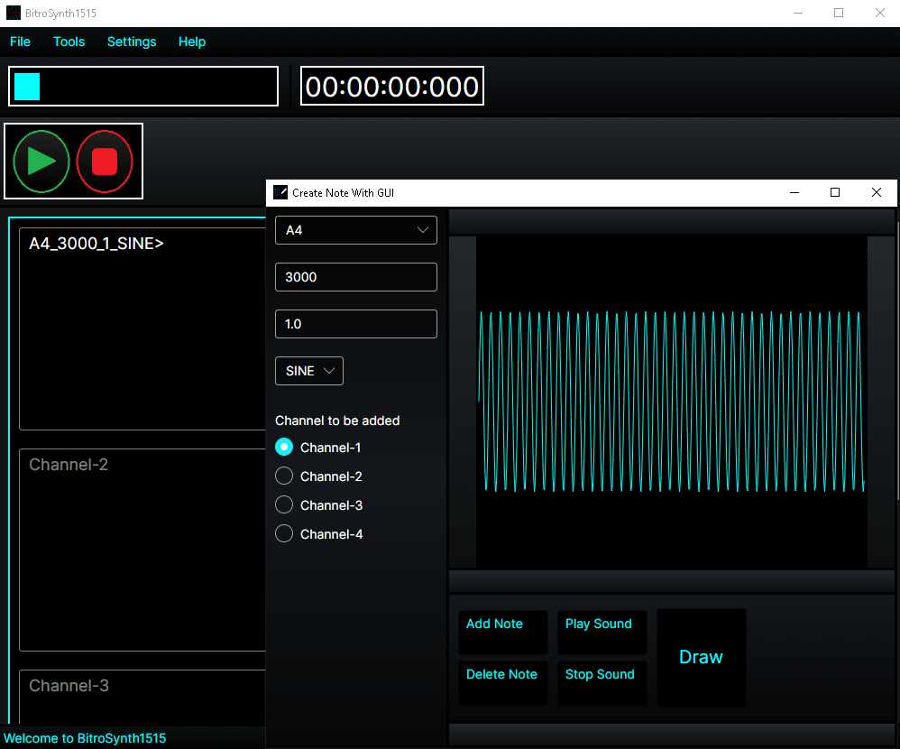

# BitroSynth1515

This project is a synthesizer with a graphical interface built using Avalonia UI and a synthesis/playback engine implemented in Rust. It supports multiple waveforms including Sawtooth, Noise, Sine, Pink Noise, Square, and Triangle.

## 📜 Third-Party Licenses
All third-party libraries used in this project are documented in the `LICENSES` folder at the root of the source code.

---
You can contact us via this email: Huseyinberke110@outlook.com
---

## © 2025 HBDigitalLabs
